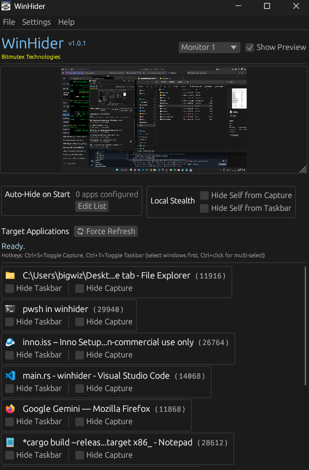
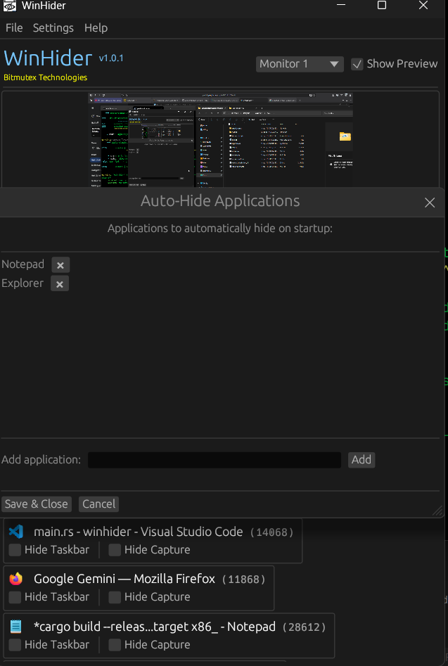
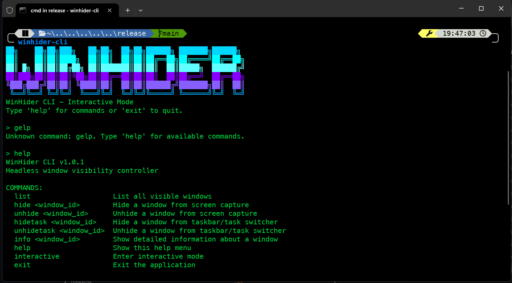

# WinHider™ - Rust Based App Hiding Solution


[](https://github.com/aamitn/winhider/actions/workflows/build.yml)
[](https://github.com/aamitn/winhider/actions/workflows/github-code-scanning/codeql)
[](./LICENSE)
[](https://github.com/aamitn/Winhider/releases/)


<a href="https://apps.microsoft.com/detail/XP99GV9280HRFP?referrer=appbadge&mode=direct">
	
</a>

| **Release Type**    | **Link**                                                                                                                                                                                            |
|---------------------|-----------------------------------------------------------------------------------------------------------------------------------------------------------------------------------------------------|
| **Winget**          | **`winget install winhider`**                                                                                                                                                                       |
| **Github Release**  | [Installer Link](https://github.com/aamitn/winhider/releases/download/v0.8.15/WinhiderInstaller.exe) • [Zip Bundle Link](https://github.com/aamitn/winhider/releases/download/v0.8.15/Winhider.zip) |
| **Microsoft Store** | [Store Link](https://aka.ms/AAxky1o)                                                   |

**OLD Win-32 Version** : [Release](https://github.com/aamitn/winhider/releases/tag/v0.8.16) **|** [Repo](https://github.com/aamitn/winhider/tree/win32-ver)

<span style="font-size:1.4em;">**`WinHider™`**</span>  (short for _`Window Hider`_) is Rust based WinAPI application that allows you to hide user defined windows from screensharing (zoom, ms-teams, gmeet etc.) and also from taskbar / taskswitcher (Alt-Tab). 

**Docs & landing page Website:** [`astro-site`](./site)

## Features
- Hide from Screenshare/Taskbar/Taskswitcher
- Auto-Hide List Feature
- Comes in both GUI and Headless/CLI variants
- Hotkeys, Multi App Actions, Auto-Updates and much more

## App Screenshots

<table>
<tr>
<td>

</td>
<td>
<br/><br/>

</td>
</tr>
</table>

## What does WinHider™ do exactly?

It is an aplication to hide/unhide app windows from screenshare and taskbar/taskswitcher while still be able to use and interact with the applciation in your system. 

Below is an explainer video:


>The above GIF illustrates how I used WinHider to hide the Notepad window from my screenshare and taskbar/taskswitcher while still being able to see it on my end. This is useful when you want to share your screen but don't want the other participants to see the Screensharing window itself.

### What goes under the hood? 

The tool performs dll injection with dlls containg targets for :
- [SetWindowDisplayAffinity](https://docs.microsoft.com/en-us/windows/win32/api/winuser/nf-winuser-setwindowdisplayaffinity) to `WDA_EXCLUDEFROMCAPTURE`. (For hiding from screenshare)
- Modifying the window’s [extended styles](https://learn.microsoft.com/en-us/windows/win32/winmsg/extended-window-styles) (For hiding from taskbar & taskswitcher) : 
  1. It removes the [`WS_EX_APPWINDOW`](https://learn.microsoft.com/en-us/previous-versions/dd425531(v=vs.100)) style, which normally causes a window to appear in the taskbar and Alt-Tab.
  2. It adds the [`WS_EX_TOOLWINDOW`](https://learn.microsoft.com/en-us/previous-versions/dd410943(v%3Dvs.100)) style, which hides the window from the taskbar and Alt-Tab.

## 📦 Directory Structure

- `app` – Core App + Integrated Injector
- `payload` –  DLL Creation
- `Misc` – Miscellaneous files (icons, images, etc.)
- `build.ps1` – PowerShell script to build the project with MSBUILD`
- `update-winget.cmd` – Batch script to update winget package manifests
- `sign.cmd` – Command-line script to sign the release binaries and installer

## How do I install it?

To use this application, you can either use the installer or the portable version.

### Use the binary installer (recommended)

 - Download and run [`WinhiderInstaller.exe`](https://github.com/aamitn/Winhider/releases/download/latest/WinhiderInstaller.exe).
 - Once the installation is complete, you will be able to run `Winhider` from the Start Menu.

### Download the portable zip with prebuilt binaries

- Download and extract the generated zip bundle named [`Winhider.zip`](https://github.com/aamitn/Winhider/releases/download/latest/Winhider.zip).
- Run `Winhider.exe`.


### Build The Project 

- Download and extract the source from [here](https://github.com/aamitn/winhider).
  ```bash
  git clone https://github.com/aamitn/winhider
  cd Winhider
  ```
- Build using CLI , Open Admin command Prompt / Terminal 
```bash
cargo build --release --target x86_64-pc-windows-msvc
cd target\x86_64-pc-windows-msvc\release
cargo run 
```
> after build stage, if`cargo run` gives, permission error, run the CLI as admin and rerun command.

- Alternatively you can run `build.ps1 --run` in powershell to buiild from CLI without IDE
> To build without IDE form CLI using powershell script,navigate to `target\x86_64-pc-windows-msvc\release` and run  winhider.exe

## Update `winget` Package Manifest

### Update Manifest

#### Specify URL
```bash
wingetcreate update Bitmutex.WinHider --version x.x.x --urls "https://github.com/aamitn/winhider/releases/download/vx.x.x/WinhiderInstaller.exe" 
```

#### Specify Arch
```bash
wingetcreate update Bitmutex.WinHider --version x.x.x --urls "https://github.com/aamitn/winhider/releases/download/vx.x.x/WinhiderInstaller.exe|x64"
```

#### Interactive Mode
```bash
wingetcreate update Bitmutex.WinHider --version 1.0.6 --interactive
```

### Submit Manifest
```bash
wingetcreate submit ".\manifests\b\Bitmutex\Winhider\x.x.x" --token <GITHUB_TOKEN>
```

### Alternatively, Use the provided poweershell script to update the winget package manifest:

```batch
.\publish-winget.ps1 -Version "1.0.7" -Token "GITHUB_TOKEN"
```

Or run without arguments to be prompted for the version:

```batch
.\publish-winget.ps1
```

The script will:
- Download and setup `wingetcreate`
- Generate the manifest for the specified version
- Provide instructions for manual submission to winget-pkgs

### Manual Submission to winget-pkgs

After running the script, follow these steps to submit the manifest:

1. Fork the [microsoft/winget-pkgs](https://github.com/microsoft/winget-pkgs) repository
2. Copy the generated manifest files from `./manifests/b/Bitmutex/Winhider/x.x.x/` to your fork
3. Create a pull request from your fork to `microsoft/winget-pkgs`

## Sign Release Binaries
- Use `sign.cmd` to sign the release binaries and installer. This is optional but recommended for distribution. This script signs `.exe` and `.dll` files using `signtool.exe` and a `.pfx` certificate.
- Our provided signing certificate is in `.pfx` format is at [`./Misc/WinHider.pfx`](./Misc/BitmutexCert.pfx).
- 🔐 **Default Behavior:** Running without arguments signs all `.exe` and `.dll` files in `Build\bin\Release` using the default password
- ⚙️ Arguments

	| Argument                     | Description                                                                      |
	|-----------------------------|----------------------------------------------------------------------------------|
	| `--pass "<password>"`<br>`-p "<password>"` | Use custom password for signing (quotes required)              |
	| `--signinstaller`<br>`-i`    | Sign only installer `.exe` files in `Misc\output`                               |
	| `--signall`<br>`-a`          | Sign both main binaries and installer files                                     |
	| `--help`<br>`-h`             | Show help message                                                               |
	```bash
	Example : `sign.cmd -a -p "mypass"`
	```
- 🔗 **Timestamp Server:**  `http://timestamp.comodoca.com/authenticode` (Uses Comodo’s timestamp server)
> ⚠️ **Important:** Password must be enclosed in quotes. Avoid hardcoding passwords—pass them securely using environment variables or CI/CD secrets.


## Inno Setup Switches

**Inno Installer Silent Switches** : `/VERYSILENT` , `/CURRENTUSER`  [Required for winget/ms store publishing]
- Silent Install Command:
	```sh
	WinhiderInstaller.exe /VERYSILENT /CURRENTUSER
	```

## Landing Page and Docs Site

Astro and Astro-Starlight website located at <a href="./site/">**`./site`**</a> directory

## ❓ FAQs

### **⚠️Getting Error for missing `MSVCP140.dll` , `VCRUNTIME140.dll` or `VCRUNTIME140_1.dll` , what to do?**

These errors mean the **Microsoft Visual C++ Redistributable** is not installed. Please Download and install the redistributables for your system , restart your PC and try again:
- [Visual C++ Redistributable x86 (32-bit)](https://aka.ms/vs/17/release/vc_redist.x86.exe)  
- [Visual C++ Redistributable x64 (64-bit)](https://aka.ms/vs/17/release/vc_redist.x64.exe)


### **💻 What OSes are supported?**

Microsoft Windows 10 v2004 or above. On previous versions of windows, a black screen shows up instead of hiding the window.

### **🕝Do future instances of the application get automatically hidden?**

No

### **👀 Is it possible to see a preview of the screen on my side?**
- You can simply use [`OBS Studio`](obsproject.com/download) with Windowed Projectors.
- Open OBS and do first-time setup.
- Then Right-Click under Sources-> Add-> Display Capture->OK-> Select Monitor under `Display` Dropdown-> OK. Now you will see infinity mirror if you have single diplay.
- Right click on the newly creted display under sources -> Click Windowed Projector.
- Minimize OBS and check for window hide status in projector window
- Multi-Monitor Systems will not require additional projector
<details>
<summary>Expand for Screenshot</summary>


_Tip: you can hide the Projector window from view too._

</details>

### **▶️ Could I automatically hide windows using a hotkey?**

Yes! From GUI, just click the `Activate Hotkeys` to activate hotkeys, activated by default.

> 	 **Hotkey Legend**  
	**`Ctrl+S`** -> **Toggle Hide/Unhide from Screenshare**  
	**`Ctrl+T`** -> **Toggle Hide/Unhide from Screenshare**   


## Contribution Guideline

Feel free to open an [`Issue`](https://github.com/aamitn/winhider/issues/new) / [`PR`](https://github.com/aamitn/winhider/compare) if you find a bug or would like to contribute!


